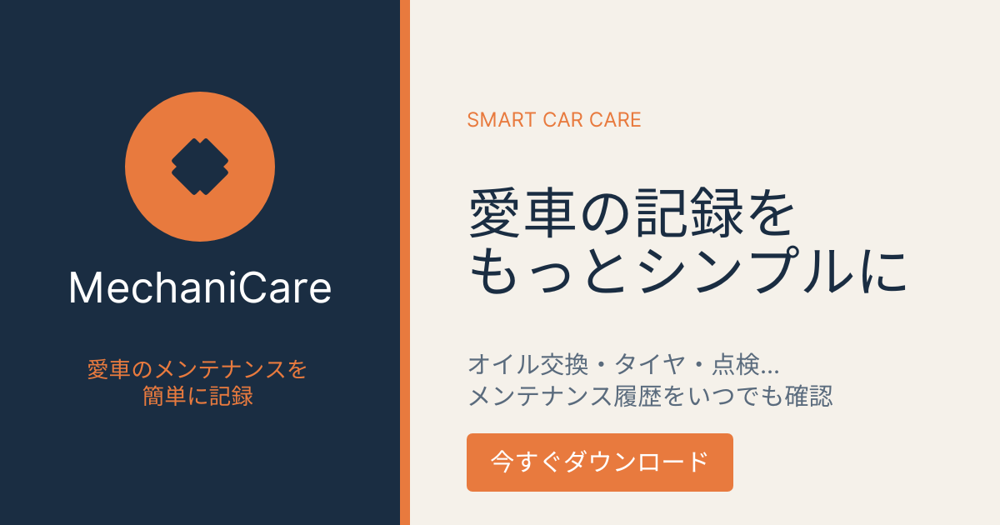

# MechaniCare

[](https://github.com/egifufox/car_maintenance_reminder/actions/workflows/ci.yml)

車のメンテナンス管理アプリケーション

## サービスURL
https://car-maintenance-reminder.onrender.com



## サービス概要
車のメンテナンス時期を忘れがちな車オーナーに、整備士の知識に基づいた適切なタイミングでのリマインド機能を提供する車両点検管理Webアプリケーションです。

## 開発背景
整備士として働いていた経験から、多くの車オーナーが「オイル交換、いつやったっけ？」「複数台持ってるけど管理が大変」「車検まだ大丈夫だと思ってた」といった問題を抱えているのを目の当たりにしてきました。

**適切なタイミングでのメンテナンスリマインドにより、車の寿命を延ばし、安全な運転をサポートしたい** という思いでこのサービスを作りました。

## ターゲットユーザー
### メインターゲット：車を大切にしたい個人オーナー
- 車検は受けるが、日常メンテナンスのタイミングが曖昧
- 「オイル交換っていつだっけ？」「タイヤ交換時期がわからない」が口癖
- メンテナンス費用は惜しまないが、適切なタイミングを知りたい

### サブターゲット：複数台管理が必要な人
- 家族の車、仕事用の車など、複数台を管理している人
- メンテナンス時期がバラバラで把握しきれない

## 主な機能
### **実装済み機能**
#### **ユーザー機能**
- ✅ ユーザー登録・ログイン機能（Devise）
- ✅ パスワードリセット機能

#### **車両管理機能**
- ✅ 車両情報の登録・編集・削除機能
- ✅ 複数車両対応
- ✅ 車両タイプ別の推奨交換時期設定（ガソリン車：5,000km / ハイブリッド車：10,000km）

#### **オイル交換記録機能**
- ✅ オイル交換記録の登録・編集・削除機能
- ✅ 次回オイル交換時期の自動計算機能（走行距離・期間ベース）

#### **その他**
- ✅ レスポンシブデザイン対応
- ✅ 利用規約・プライバシーポリシーページ
- ✅ 使い方ページ
- ✅ ページネーション
- ✅ CI/CD環境（GitHub Actions）
- ✅ コード品質管理（Rubocop）
- ✅ 静的OGP設定
- ✅ Googleログイン機能
- ✅ メール通知機能（オイル交換時期のリマインド）

## 画面イメージ
### トップページ
[](https://gyazo.com/43f35cc6c50838c529c7a6ad42d73b2e)

### 車両一覧ページ
[](https://gyazo.com/97115d23ab54b5ba6d1e50ce8355f144)

### オイル交換記録ページ
[](https://gyazo.com/35c0949ca606dc63ab826f1e8a1e2da5)

### 使い方ページ
[](https://gyazo.com/42fa5782ba4c54ba38b1f7fd7c0fa01f)


## 使用技術
### **フロントエンド**
- Hotwire（Turbo Drive）
- Importmap
- Bootstrap 5

### **バックエンド**
- Ruby 3.1.4
- Ruby on Rails 7.0.10
- PostgreSQL 14

### **認証・国際化**
- Devise（認証機能）
- OmniAuth（Googleログイン機能。CSRF対策も実装済み）
- Rails I18n（国際化対応）
- Enum Help（enumの日本語化）

### **ページネーション**
- Kaminari
- Bootstrap5 Kaminari Views（ページネーションUIのBootstrap5対応）

### **開発環境**
- Docker
- RSpec（テストフレームワーク）
- FactoryBot（テストデータ作成）
- Capybara / Selenium-webdriver（システムテスト）
- Dotenv (環境変数管理)
- Rubocop（コード品質管理）
- Brakeman（セキュリティ監査）
- Letter Opener Web（メールプレビュー）

### **CI/CD**
- Github Actions

### **インフラ・デプロイ**
- Render（本番環境）
- Mailgun（メール送信）

## 技術選定理由
### フロントエンド
Hotwire・ImportmapはRails7のデフォルト構成であるため、まずはこの標準構成を採用しました。開発を進める中で、SPAフレームワークを別途学習・導入せずに動きのあるUIを実装できる点、Webpackerのようなビルド環境構築の手間がかからない点など、実務的なメリットも実感できました。
Bootstrap5は使い慣れていたことに加え、コンポーネントが豊富で実装スピードを優先できる点が卒業制作の限られた期間に合っていました。

### バックエンド
Ruby on Railsは「設定より規約」という思想により、少人数・短期間での開発に向いています。またDeviseやKaminariなど実績のあるGemが豊富に存在し、認証やページネーションといった機能を安全かつ効率的に実装できる点も選定理由の一つです。MVCアーキテクチャにより責務が明確に分かれているため、機能追加時の見通しも良く、個人開発でも保守性を保ちやすいと考えました。

### 認証
DeviseはRailsで広く使われている実績のあるgemであり、認証機能を簡易的かつ安全に実装できるので採用しました。
OmniAuth（Googleログイン）はユーザーが個別にパスワードを設定・管理する必要がなくなり、セキュリティリスクとユーザーの手間を同時に減らせた。Google側で二段階認証などのセキュリティ管理がされているため、自前で実装するより安全性が高いので導入しました。

### ページネーション
Rails標準にはページネーション機能がなくgemが必要ため、kaminariを採用しました。pagyに比べて、Bootstrap5対応のViewが公式で用意されていて実装が早かったです。

### 開発環境
チーム開発を想定した際に「環境差異によるバグ」を防ぐため、またRUNTEQのカリキュラムで扱っており実績があったためDockerを採用しました。ホストOSに依存せず誰でも同じ開発環境を再現できる点も、個人開発からチーム開発への拡張性を考えた際のメリットです。

### CI/CD
「実行し忘れる」「ローカルでは通ったが他の人の環境では通らない」という問題を防ぐため、mainへのpush・PR作成時にテスト・Lintを自動実行するCIを導入しました。
当初はpushをトリガーに即デプロイする構成にしていましたが、この方法だとテストが失敗していてもデプロイが実行されてしまうという課題がありました。そこで、CI(テスト・Lint)が成功した場合のみデプロイを実行する構成に変更しました。（別ファイルのワークフローを連携させるworkflow_runトリガーを採用）。CIの実行結果(conclusion)がsuccessの場合のみデプロイジョブを実行する条件を加えることで、「テストが通った時だけ本番にデプロイされる」安全な構成にしています。

### インフラ・デプロイ
Renderを選定した理由は、無料枠があり個人開発でコストをかけずに本番環境を構築できること、またPostgreSQLのマネージドサービスを利用できることです。またSendGridと異なり無料枠があったため、Mailgunを選定しました。

## ER図
[](https://gyazo.com/d65a33b668a9c77c2110e8c387f3ab4a)

### テーブル構成は大きく分けて、「ユーザー情報」 「車両情報」 「オイル交換記録」 の3つに分類されます。


## セットアップ方法
### **前提条件**
- Docker
- Docker Compose

### **起動手順**
```bash
# リポジトリのクローン
git clone https://github.com/egifufox/car_maintenance_reminder.git
cd car_maintenance_reminder

# Dockerコンテナの起動
docker compose up -d

# データベースの作成
docker compose exec web bin/rails db:create

# マイグレーション実行
docker compose exec web bin/rails db:migrate

# サーバーの起動
docker compose up
```

### アクセス
http://localhost:3000

### テストの実行
```bash
# RSpecの実行
docker compose exec web bundle exec rspec

# Rubocopの実行
docker compose exec web bundle exec rubocop
```

**一般的なCRUD以外の実装機能**

#### **次回交換時期の自動計算（MVPのコア機能）**
オイル交換の履歴から、次回交換時期を自動計算して表示。

**実装方針**：
- **走行距離ベース**: 前回交換から5,000km経過で通知
（ハイブリッド車の場合は10,000km）
- **期間ベース**: 前回交換から1年経過で通知
- **両方の条件**: いずれか早い方で判定

**使用技術**：
- Railsのモデルメソッドで実装（`Vehicle#km_until_next_oil_change`等）
- 車両タイプ（ガソリン車/ハイブリッド車）に応じた計算ロジック

**実装イメージ**：
```ruby
# app/models/vehicle.rb
class Vehicle < ApplicationRecord
  has_many :oil_change_records, dependent: :destroy
  
  # 最後のオイル交換記録
  def last_oil_change
    oil_change_records.order(changed_at: :desc).first
  end
  
  # 車両タイプに応じた次回交換までの走行距離
  def oil_change_interval_km
    hybrid? ? 10_000 : 5_000
  end
  
  # 次回交換まであと何km?
  def km_until_next_oil_change
    return nil if last_oil_change.blank?
    oil_change_interval_km - (current_mileage - last_oil_change.mileage)
  end
  
  # 次回交換まであと何日?
  def days_until_next_oil_change
    return nil if last_oil_change.blank?
    target_date = last_oil_change.changed_at + 1.year
    (target_date - Date.today).to_i
  end
  
  # 交換時期が近い?(1000km以内または1ヶ月以内)
  def needs_oil_change_soon?
    km_until_next_oil_change.present? && km_until_next_oil_change <= 1000 ||
    days_until_next_oil_change.present? && days_until_next_oil_change <= 30
  end
end
```

## こだわった実装
### こだわった実装は以下の機能になります。
- ユーザー認証機能
- 整備士の経験を活かした機能設計
- 

### ユーザー認証機能
`Devise`はRailsで広く使われている実績のあるgemであり、認証機能を簡易的かつ安全に実装できるので採用しました。
`OmniAuth（Googleログイン）`はユーザーが個別にパスワードを設定・管理する必要がなくなり、セキュリティリスクとユーザーの手間を同時に減らせた。Google側で二段階認証などのセキュリティ管理がされているため、自前で実装するより安全性が高いので導入しました。

### 整備士の経験を活かした機能設計
- 車両タイプ（ガソリン車/ハイブリッド車）に応じた推奨交換時期の自動計算
- 走行距離ベースと期間ベースの両方で交換時期を判定

### **ユーザビリティの向上**
- 複数車両の管理が簡単

### **コード品質の担保**
- RSpecによるテストカバレッジ
- Rubocopによるコード品質管理
- GitHub Actionsによる自動テスト

## 今後の開発について
今後、以下の機能を実装予定です。
- スマホのレスポンシブデザイン対応
- ダッシュボード機能（今月やるべきメンテナンス一覧）
- 車種別メンテナンス推奨項目
- 独自ドメイン設定
- なぜそのタイミングなのか等の解説ページ